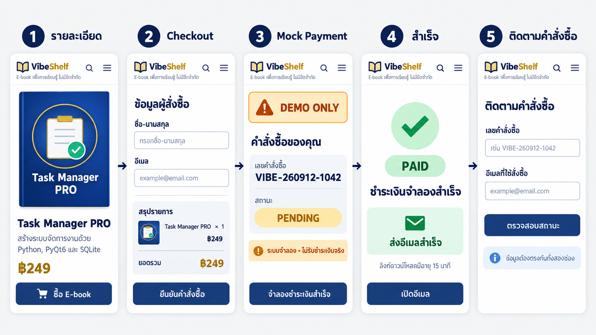

# UI Design Spec — VibeShelf E-book Shop

สถานะ: ปรับใช้กับเว็บไซต์แล้ว

## 1. แนวคิดของระบบ

VibeShelf เป็นร้าน E-book ภาษาไทยที่นำผลงานเดิม 3 โปรเจกต์มาพัฒนาเป็นหนังสือดิจิทัล เน้นหน้าตาสะอาด อ่านง่าย และใช้งานได้ทั้งเว็บเดสก์ท็อปกับมือถือ

- สีหลัก: Forest Green
- สีเน้น: Clay Brown / Warm Ochre
- สีสถานะสำเร็จ: Green
- พื้นหลัง: Paper Cream
- รูปแบบ: Natural modern bookstore, อ่านง่าย และเป็นมิตร
- ขอบเขต: หน้าผู้ซื้อเท่านั้น ไม่มีหน้า Admin และไม่มีการรับเงินจริง

## 2. ภาพออกแบบ

### หน้าร้านบนเดสก์ท็อป

องค์ประกอบหลัก: เมนูนำทาง, Hero, การ์ด E-book 3 รายการ, ปก, ชื่อ, คำอธิบายย่อ, ราคา, ปุ่มดูรายละเอียด, จุดยืนยันการส่งลิงก์ดาวน์โหลด และข้อความแจ้งว่าเป็นระบบสาธิต

### เส้นทางสั่งซื้อบนมือถือ

เส้นทางหลัก: รายละเอียดหนังสือ → Checkout → สร้างคำสั่งซื้อ PENDING → Mock Payment แบบ DEMO ONLY → PAID และส่งอีเมล → ติดตามคำสั่งซื้อด้วยข้อมูลสองส่วน

## 3. ข้อมูล E-book ที่ใช้ในแบบ

| รายการ | ที่มาจากงานเดิม | คำอธิบายย่อในหน้าร้าน | ราคาตัวอย่าง |
|---|---|---|---:|
| Tarot App | `C:\Users\HP\.gemini\antigravity\scratch\tarot-app` | สร้างแอปเปิดไพ่ 3 กาลด้วย Python + PyQt6 | ฿199 |
| Task Manager PRO | `C:\Users\HP\.gemini\antigravity\scratch\task-manager-pro` | จัดการงานด้วย SQLite, Dashboard และระบบสำรองข้อมูล | ฿249 |
| Media Player PRO | `C:\Users\HP\.gemini\antigravity\scratch\media-player-pro` | สร้างเครื่องเล่นเพลงพร้อม Playlist, Seek และ Volume | ฿179 |

หมายเหตุ: ชื่อ คำโปรย และราคาเป็นข้อมูลตั้งต้นสำหรับแบบ UI สามารถปรับก่อนเริ่มพัฒนาได้ ปกหนังสือใช้สีและสัญลักษณ์จาก `assets/app.png` ของแต่ละโปรเจกต์เป็นแนวทาง

## 4. หน้าจอที่ระบบต้องมี

### 4.1 หน้าร้าน

- Header: ชื่อร้าน, หน้าร้าน, ติดตามคำสั่งซื้อ, วิธีใช้งาน
- Hero: บอกว่าเป็น E-book จากผลงานจริงและอธิบายภาพรวมสั้น ๆ
- Product Grid: หนังสืออย่างน้อย 3 รายการ
- Product Card ทุกใบต้องมีปก, ชื่อ, คำอธิบายย่อ, ราคา และปุ่ม “ดูรายละเอียด”
- Footer/Notice: “ระบบสาธิต • Mock Payment • ไม่รับชำระเงินจริง”

เมื่อกด “ดูรายละเอียด” ให้เปิดหน้ารายละเอียดของหนังสือที่เลือก

### 4.2 หน้ารายละเอียดหนังสือ

- ปกขนาดใหญ่, ชื่อ, คำอธิบาย, เนื้อหาที่จะได้รับ และราคา
- ปุ่ม “ซื้อ E-book”
- ข้อความกำกับว่าเป็น Digital E-book และส่งลิงก์ดาวน์โหลดทางอีเมลหลังสถานะ PAID

เมื่อกด “ซื้อ E-book” ให้ไป Checkout โดยเก็บรายการหนังสือที่เลือกไว้

### 4.3 หน้า Checkout

- ช่องชื่อ-นามสกุล
- ช่องอีเมล พร้อม validation รูปแบบอีเมล
- สรุปรายการ: ปกย่อ, ชื่อหนังสือ, จำนวน, ราคา และยอดรวม
- ปุ่ม “ยืนยันคำสั่งซื้อ”

เมื่อยืนยันสำเร็จ ระบบต้องสร้างเลขคำสั่งซื้อที่ไม่ซ้ำ บันทึกสถานะเริ่มต้นเป็น `PENDING` และแสดงหน้าคำสั่งซื้อ

### 4.4 หน้าคำสั่งซื้อและ Mock Payment

- เลขคำสั่งซื้อ
- รายการและยอดรวม
- Status Badge: `PENDING`
- ป้าย `DEMO ONLY` สีส้มที่มองเห็นเด่นชัด
- ข้อความ “ระบบจำลอง • ไม่รับชำระเงินจริง”
- ปุ่ม “จำลองชำระเงินสำเร็จ”
- ห้ามมีช่องบัตรเครดิต, QR ธนาคาร, Payment Gateway จริง หรือข้อมูลการโอนเงินจริง

เมื่อกดปุ่มจำลองสำเร็จ ระบบเปลี่ยนสถานะเป็น `PAID` และเริ่มขั้นตอนส่งอีเมล

### 4.5 หน้าสำเร็จ

- Status Badge: `PAID`
- ข้อความ “ชำระเงินจำลองสำเร็จ”
- ผลการส่งอีเมล เช่น “ส่งอีเมลสำเร็จ” หรือข้อความทดสอบที่เทียบเท่า
- แจ้งว่าลิงก์ดาวน์โหลดเป็นลิงก์ชั่วคราว
- ปุ่มเปิดอีเมลหรือกลับหน้าร้าน
- ยังคงแสดงบริบท `DEMO ONLY` เพื่อไม่ให้เข้าใจว่าเป็นการชำระเงินจริง

### 4.6 หน้าติดตามคำสั่งซื้อ

- ช่องเลขคำสั่งซื้อ
- ช่องอีเมลที่ใช้สั่งซื้อ
- ปุ่ม “ตรวจสอบสถานะ”
- แสดงผลเฉพาะเมื่อเลขคำสั่งซื้อและอีเมลตรงกันทั้งสองช่อง
- หากข้อมูลไม่ตรง ให้แสดงข้อความกลาง ๆ และห้ามเปิดเผยชื่อ อีเมล รายการ หรือสถานะของผู้อื่น

## 5. การออกแบบ Responsive

| ขนาดหน้าจอ | รูปแบบ |
|---|---|
| Desktop ≥ 1024 px | การ์ดหนังสือ 3 คอลัมน์, Checkout แบบ Form + Summary สองคอลัมน์ |
| Tablet 768–1023 px | การ์ด 2 คอลัมน์, Summary ย้ายลงใต้ Form เมื่อพื้นที่ไม่พอ |
| Mobile < 768 px | การ์ด 1 คอลัมน์, เมนูแบบ Hamburger, ปุ่มหลักกว้างเต็มพื้นที่, ฟอร์มเรียงแนวตั้ง |

ข้อกำหนดร่วม: ปุ่มกดง่ายบนจอสัมผัส, ตัวอักษรเนื้อหาไม่เล็กกว่า 16 px, ไม่ใช้ pop-up เป็น flow หลัก และผู้ใช้ย้อนกลับใน WebView ได้ตามประวัติหน้าเว็บ

## 6. สถานะและข้อความผิดพลาดที่ต้องออกแบบ

- Loading: กำลังสร้างคำสั่งซื้อ / กำลังตรวจสอบสถานะ / กำลังส่งอีเมล
- Validation: ชื่อว่าง, อีเมลว่าง, รูปแบบอีเมลไม่ถูกต้อง
- Order error: สร้างคำสั่งซื้อไม่สำเร็จ พร้อมปุ่มลองอีกครั้ง
- Payment error: จำลองชำระเงินไม่สำเร็จ และสถานะยังเป็น `PENDING`
- Tracking not found: “ไม่พบคำสั่งซื้อจากข้อมูลที่ระบุ” โดยไม่บอกว่าช่องใดถูกหรือผิด
- Email error after PAID: สถานะยังคงเป็น `PAID` แต่แจ้งว่าส่งอีเมลไม่สำเร็จและมีแนวทางลองใหม่
- Expired link: ลิงก์หมดอายุ พร้อมคำแนะนำให้ขอลิงก์ใหม่จากหน้าติดตามคำสั่งซื้อ

## 7. UI Acceptance Checklist

- [x] มีแบบหน้าร้านและ flow บนมือถือ
- [x] หน้าร้านมี E-book 3 รายการ พร้อมปก ชื่อ คำอธิบายย่อ และราคา
- [x] มีหน้ารายละเอียดและ Checkout ที่เห็นสรุปรายการก่อนยืนยัน
- [x] มีจุดแสดงเลขคำสั่งซื้อและสถานะ `PENDING`
- [x] มีป้าย `DEMO ONLY` ชัดเจนและไม่มีองค์ประกอบรับเงินจริง
- [x] มีสถานะ `PAID` และผลการส่งอีเมล
- [x] มีหน้าติดตามคำสั่งซื้อที่ต้องใช้เลขคำสั่งซื้อและอีเมลร่วมกัน
- [x] มีแนวทาง Responsive สำหรับ Desktop, Tablet และ Mobile
- [x] ผู้ใช้อนุมัติให้ปรับเป็นธีมธรรมชาติและลดข้อความบนหน้าร้าน

## 8. ขอบเขตสำหรับขั้นพัฒนา

หลังอนุมัติ UI จึงเริ่มสร้างระบบตามลำดับ: หน้าร้าน → รายละเอียด → Checkout → Order `PENDING` → Mock Payment → `PAID` → Email → Tracking → Deploy → Mobile WebView wrapper

ไม่อยู่ในขอบเขต: หน้า Admin, Payment Gateway จริง, QR ธนาคารจริง, เก็บข้อมูลบัตร, ระบบคืนเงิน, คูปอง และ DRM เต็มรูปแบบ
